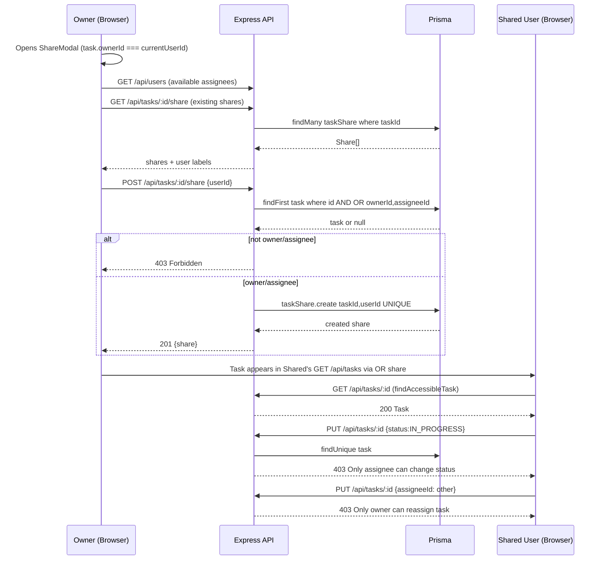

# System Architecture and Flows

The backend implements a layered architecture (Clean Architecture), separating Controllers (Routers), Use Cases (Services), and Repositories.

## REST JSON API
The REST standard is used since the domain (Task CRUD) is flat, making it natural to use HTTP status codes for idempotency (`409 Conflict`) and business rule validations (`403 Forbidden`, `422 Unprocessable Entity`).

## Critical Flow: `markAsDone`
To demonstrate Cloud ecosystem expertise and decoupling of intensive processes, this use case is externalized to an **AWS Lambda**:
1. The client sends a `PATCH /tasks/{id}/done` including the `Idempotency-Key` header.
2. The API intercepts the request and validates idempotency against **Redis**.
3. If valid, the API invokes the Lambda function (deployed on AWS) via the AWS SDK.
4. The Lambda processes the transaction in PostgreSQL and responds to the API, which returns to the client.

## Advanced Technical Considerations (High Concurrency)

### Race Condition Handling
To prevent two requests from marking the same task as `DONE` simultaneously, two layers of protection are implemented:
* **Application Level (Idempotency):** Redis middleware. The `SETNX` (Set if Not Exists) command is used with the `Idempotency-Key` and a TTL. If the key already exists, the duplicate request is rejected, protecting the database.
* **Database Level (Pessimistic Locking):** The SQL transaction uses the `WITH FOR UPDATE` clause on the task row. This ensures ACID atomicity; if Lambda A is updating the row, Lambda B will wait or fail in a controlled manner.

### Connection Pool Exhaustion
When using Cloud Functions that scale horizontally, direct connections to PostgreSQL can exhaust database resources. To mitigate this, **PgBouncer** is placed between the backend/Lambda and PostgreSQL (simulating the role of AWS RDS Proxy).

### Observability and Logging
A middleware is implemented to log all API activity using structured JSON logs. Each log includes: `timestamp`, `actor` (Cognito `user_id`), `method`, `path`, `query_params`, `sanitized_body`, and `status_code`.

## Security: JWT Storage + CSRF

### Design Decision (Implemented)
The Cognito `id_token` is stored in an `httpOnly` cookie (`__Host-id_token`) with `Secure + SameSite=Strict + Path=/`. This decision is paired with **API Gateway as single entrypoint** (`CloudFront -> API Gateway -> Express private VPC`) and a **Double Submit Cookie CSRF** token (`__Host-csrf`).

Previous `localStorage` approach traded XSS security for simplicity; the current design prioritizes XSS protection for production (see Gateway migration spec).

### Tradeoff

| Approach | XSS Protection | CSRF Protection | Persistence | Complexity |
|----------|---------------|-----------------|-------------|------------|
| localStorage (legacy, fallback) | ❌ Vulnerable | ✅ Complete | ✅ Persists | Low |
| **httpOnly Cookie + Double Submit CSRF (current)** | ✅ Complete | ✅ Complete (SameSite + header check) | ✅ Persists | Medium |
| BFF Pattern | ✅ Complete | ✅ Complete | ✅ Persists | High |
| In-Memory | ✅ Complete | ✅ Complete | ❌ Lost on refresh | Low |

### Why localStorage is Vulnerable to XSS
If an attacker injects malicious JavaScript (XSS), they can execute `localStorage.getItem('id_token')` and exfiltrate the token. With the stolen token, the attacker can make authenticated requests as the user. `httpOnly` prevents `document.cookie` / `localStorage` access; the token is only sent automatically by the browser.

### Implemented Production Flow (httpOnly + CSRF)
1. Frontend `LoginPage.tsx` calls `POST /api/auth/login {email,password}` (no direct `cognito-idp` fetch).
2. Backend `auth.controller.ts` uses `CognitoIdentityProviderClient InitiateAuth` to validate credentials, then issues:
   - `Set-Cookie: __Host-id_token=<JWT>; HttpOnly; Secure; SameSite=Strict; Path=/; Max-Age=3600`
   - `Set-Cookie: __Host-csrf=<raw>.<hmac>; Secure; SameSite=Strict; Path=/; Max-Age=3600` (NOT httpOnly, readable by JS)
   - Body `{csrfToken}` for convenience.
3. `axios-client.ts` uses `withCredentials:true` and an interceptor that reads `__Host-csrf` from `document.cookie` and sends `X-CSRF-Token` header on every request.
4. `middlewares/csrf.ts` (`csrfProtection`) enforces Double Submit on all mutating methods (`POST/PUT/PATCH/DELETE`): verifies `cookieToken === headerToken` and HMAC signature (`timingSafeEqual`). `GET/HEAD/OPTIONS` are exempt. `GET /api/auth/csrf` can re-issue/rotate the token.
5. `middlewares/auth.ts` reads `req.cookies['__Host-id_token']` first, fallback to `Authorization: Bearer` for backward compat/migration. Gateway forwards cookies via `VPC Link`; `CORS` is `credentials:true` with explicit `Allow-Origin`.

### Gateway Integration Notes
- CloudFront forwards `__Host-*` cookies and `X-CSRF-Token`/`Idempotency-Key` headers to API Gateway.
- API Gateway `HTTP API` CORS: `allow_origins=[frontend_domain]`, `allow_credentials=true`, `allow_headers=[Content-Type,X-CSRF-Token,Idempotency-Key]`.
- Native Cognito Authorizer (expects `Authorization` header) is not used for cookie flow; JWT verification stays in Express (`auth.ts:verifyToken` via JWKS). Optionally replace with Lambda Authorizer that parses `Cookie` in future.
- `POST /api/auth/logout` clears both cookies (`clearCookie` with same `Secure/SameSite/Path` opts).

### Current Auth Identity Endpoint
`GET /api/auth/me` (authenticated) returns `{ id, email, isAdmin }` from the verified JWT. `isAdmin` is `email === env.ADMIN_EMAIL` (default `admin@insightt.com`). The dashboard (`DashboardPage`) uses `useCurrentUser()` to resolve `currentUserId` reliably even when `localStorage id_token` is absent (httpOnly). `Layout` uses `isAdmin` to show/hide the **Users** entry, so non-admins never see the user-management menu.

### User Registration & Password Lifecycle
- `POST /api/auth/register {email,password,name?}` → Cognito `SignUp` + `admin-confirm-sign-up` (no email delivery is configured, so the account is active immediately).
- Admins create users through `POST /api/users` (admin-only): it creates the Cognito user via `AdminCreateUser` with a random temporary password (`MessageAction: SUPPRESS`) → status `FORCE_CHANGE_PASSWORD`, and returns `{ user, temporaryPassword }` for the admin to share.
- On first login the temporary password makes `InitiateAuth` return a `NEW_PASSWORD_REQUIRED` challenge; the backend responds `{ challenge, session }` (no cookies yet), the client calls `POST /api/auth/change-password {email,session,newPassword}` → `RespondToAuthChallenge` → session cookies are issued.
- `POST/PUT/DELETE /api/users` are guarded by `requireAdmin` (`email === env.ADMIN_EMAIL`); reads (`GET /users`, `/users/all`) stay open to authenticated users for the assignee dropdowns.

## Layout & Navigation

`Layout.tsx` renders a sticky `AppBar` with:
- **Left:** Logo (`TaskAlt`) + `Insightt` title (navigates to `/tasks`).
- **Center (desktop, `md`+):** `Tasks` (→ `/tasks`), `Users` (admin-only, → `/users`), `Documentation` (Menu: Markdown docs + HTML diagrams that open in a new tab). Centered via `flex:1 justifyContent:center`.
- **Right:** Dark mode toggle (`useColorMode`) + Logout.
- **Mobile (`down(md)`):** Hamburger `Drawer` (right, 300px) with collapsible `Usuarios` and `Documentación` sections plus theme toggle. `useMediaQuery` controls switching.

Routes (`App.tsx`):
- `/login` → `LoginPage` (public)
- `/tasks` → `DashboardPage`
- `/users` → `UsersPage` (supports `?action=create` auto-open)
- `/docs` → `DocumentationPage` (Markdown cards + HTML diagram previews)
Protected via `ProtectedRoute` (checks `csrf_token` or `localStorage id_token`; 401 interceptor redirects).

Theme: `ColorModeProvider` persists `light|dark` in `localStorage`, respects `prefers-color-scheme`, injects `getTheme(mode)` (background `#0f172a/#f1f5f9`, primary `#4f46e5`).

## Kanban Board — Drag & Drop + Mobile Fallback

`DashboardPage` renders tasks as a 4-column board (`KanbanBoard` + `KanbanColumn` + `TaskCard`) with responsive behavior:
- **Desktop (`md`+):** 4 equal columns via `display:grid; gridTemplateColumns: repeat(4,1fr)` — 100% visible, no horizontal scroll. `DndContext` with `PointerSensor(distance:8)` + `TouchSensor(delay:200)` + `closestCenter` + `DragOverlay` (rotated card). Columns are `Paper` with `hexToRgba(accent, 0.10)` background (see below).
- **Mobile (`down(md)`):** Stack of `Accordion` (all `defaultExpanded={false}`), no drag. Each `TaskCard` shows move buttons.

### Reversible State Machine
`PENDING ↔ IN_PROGRESS ↔ DONE ↔ ARCHIVED` plus direct archive (`PENDING/IN_PROGRESS → ARCHIVED`). Implemented in `types/task.ts` + `backend/state-machine.ts`:

```ts
PENDING: ['IN_PROGRESS','ARCHIVED']
IN_PROGRESS: ['PENDING','DONE','ARCHIVED']
DONE: ['IN_PROGRESS','ARCHIVED']
ARCHIVED: ['DONE']
```

The `ARCHIVED → DONE` path enables unarchive. The lock in `TaskRepository.update/updateWithPermission` was fixed to allow status transitions even when `DONE/ARCHIVED` (only `description` and non-title fields remain blocked; `title` + valid transitions allowed). Invalid jumps (e.g., `PENDING→DONE`) are still `422`.

### Component Hierarchy (updated)
```
Layout (AppBar centered nav + Drawer)
 └─ DashboardPage
     ├─ FilterPanel (desktop Paper / mobile Accordion)
     ├─ KanbanBoard (DndContext on desktop | Stack Accordion on mobile)
     │   ├─ KanbanColumn status=PENDING  (useDroppable id=status, SortableContext, accent #f59e0b, bg rgba(245,158,11,0.10))
     │   │   └─ SortableTaskCard[] (useSortable id=task.id, disabled if !isDraggable)
     │   │       └─ TaskCard (urgency Warm palette, importance Cool palette, email, yyyy-MM-dd)
     │   ├─ KanbanColumn status=IN_PROGRESS (#3b82f6)
     │   ├─ KanbanColumn status=DONE (#10b981)
     │   └─ KanbanColumn status=ARCHIVED (#64748b)
     ├─ TaskForm / ShareModal
     └─ Fab (circular + hover shadow, fixed bottom:28 right:28)
```

`KanbanColumn` is a droppable container (`useDroppable({ id: status })`) and `SortableContext`. `SortableTaskCard` wraps `TaskCard` with `useSortable({ id: task.id, disabled: !isDraggable })` where `isDraggable = !currentUserId ? true : ownerId===me || assigneeId===me || !assigneeId` (allows owner to drag unassigned tasks; fallback true when `useCurrentUser` still loading).

Column visuals:
- Top 4px bar `bg accent` with `borderTopLeft/RightRadius:12` so radius is preserved.
- Column `bg = hexToRgba(accent, 0.10)` (light) / `0.12` (dark); on `isOver` → `0.16/0.18` + `boxShadow 0 0 0 2px accent40`.
- Header: `8px` dot + `STATUS_LABELS` + `Chip` count; interior `Stack` bg tinted on hover.

`TaskCard` changes:
- Urgency (Warm amber→red) vs Importance (Cool sky→violet) with icons `Flag/Star` and labels `Urgency: X` / `Importance: Y`.
- Dates formatted via `formatDateISO` → `yyyy-MM-dd` (no `T00:00…`).
- Assignee shows `email` via `assigneeEmailMap` (from `useUsers + useCurrentUser`), fallback to `id`.
- Mobile footer adds `Prev/Next` arrow buttons (`isMobile`): `Prev` → `STATUS_ORDER[idx-1]` if `VALID_TRANSITIONS[current].includes(prev)`, `Next` → `STATUS_ORDER[idx+1]`; calls `onMove` (Dashboard `handleMove` → `PUT /api/tasks/:id {status}`).
- Desktop footer keeps `Share/Edit/Archive/MarkDone/Delete`; `PENDING` has no transition button (drag only), `IN_PROGRESS` → `Mark Done` (via `markAsDone`), `DONE` → `Archive` (`updateWithPermission`), `ARCHIVED` none. Edit disabled only for `ARCHIVED` (so `DONE` title typo fix remains allowed).

### Drag-End Sequence (reversible)
```mermaid
flowchart TD
    A[User drags TaskCard] --> B[DndContext closestCenter]
    B --> C{handleDragEnd active.id, over.id}
    C --> D{over.id is TaskStatus?}
    D -- yes --> E[newStatus = over.id]
    D -- no --> F{over is task? newStatus = overTask.status}
    F --> G{containerId fallback}
    E --> H{newStatus === currentStatus? skip}
    F --> H
    G --> H
    H -- same --> I[No-op]
    H -- different --> J{VALID_TRANSITIONS[current].includes(newStatus)?}
    J -- no --> K[Ignore invalid PENDING->DONE]
    J -- yes --> L[onMove taskId, newStatus]
    L --> M[DashboardPage handleMove: owner||assignee||unassigned?]
    M --> N{permission ok?}
    N -- no --> O[Snackbar: Only owner or assignee can move]
    N -- yes --> P[PUT /api/tasks/:id {status:newStatus} via updateWithPermission]
    P --> Q{validateStateTransition}
    Q -- 422 --> R[Snackbar invalid transition]
    Q -- 403 --> S[Snackbar forbidden]
    Q -- 200 --> T[React Query invalidates tasks, re-renders board]
```

Mobile path: `TaskCard Prev/Next → mobileMoveHandler → onMove → handleMove → same PUT chain` (no DndContext).

## Filter Flow

Filters are held in `DashboardPage` as `TaskFilters` and synced to URL `searchParams` for shareable state, then forwarded to `useTasks(filters)` → `fetchTasks(filters)` → `GET /api/tasks?title=&tags=&assigneeId=&...` → `TaskRepository.findByOwner(ownerId, filters)`.

```mermaid
flowchart LR
    U[User interacts FilterPanel] --> S[onChange filters]
    S --> URL[useSearchParams set]
    URL --> Q[useTasks queryKey tasks,filters]
    Q --> API[GET /api/tasks?params]
    API --> REPO[findByOwner OR ownerAssigneeShare + hasSome, mode insensitive, date ranges, urgency, importance, overdue]
    REPO --> DB[(PostgreSQL)]
    DB --> RES[Task[] desc createdAt]
    RES --> Board[KanbanBoard groupByStatus]
    Board --> Card[TaskCard with deadlineBorder]
    FilterPanel --> Chips[Active filter Chips + Clear]
```

Responsive wrapper: On `down(md)`, `FilterPanel` itself renders as an `Accordion` (`FilterListIcon`, `defaultExpanded:false`) with `activeCount` chip (sum of all active filters) in summary; content is `FilterContent` (same fields). Desktop renders `Paper` with title `Filters`.

## Users Management

`UsersPage` (`/users`) provides full CRUD via `POST/PUT/DELETE /api/users` (authenticated) plus `GET /api/users/all` for admin table:

- **List:** `useAllUsers` → `Table` with avatar, name, email, 8-char id, `Tú` chip for `me`. Dark-mode aware.
- **Create:** `Crear usuario` (`/users?action=create` auto-opens dialog). Dialog validates email regex, posts `{email,name}` → `201` or `409 Email already exists`.
- **Edit:** Pencil icon opens dialog prefilled, `PUT /api/users/:id`.
- **Delete:** Trash icon → confirm dialog. Backend checks `id===callerId → 403`, `owned tasks → 409`, otherwise nulls `assigneeId`, deletes `task_shares`, then `user`.

Quota: `TaskCard` assignee label resolves via `assigneeEmailMap` (see above).

```mermaid
sequenceDiagram
    participant Admin as Admin (Browser)
    participant API as Express API
    participant DB as PostgreSQL

    Admin->>API: GET /api/users/all
    API->>DB: SELECT id,email,name FROM users ORDER BY created_at DESC
    DB-->>Admin: User[]
    Admin->>Admin: Opens Create dialog
    Admin->>API: POST /api/users {email,name}
    API->>DB: INSERT users
    DB-->>API: created
    API-->>Admin: 201 {user} -> invalidate users/all + users
    Admin->>API: PUT /api/users/:id {email,name}
    API->>DB: UPDATE users SET email,name
    API-->>Admin: 200
    Admin->>API: DELETE /api/users/:id
    API->>DB: SELECT COUNT(*) FROM tasks WHERE owner_id=:id
    alt owns tasks >0
        API-->>Admin: 409 reassign first
    else
        API->>DB: UPDATE tasks SET assignee_id=NULL WHERE assignee_id=:id; DELETE shares; DELETE users
        API-->>Admin: 204
    end
```

## Documentation Viewer

`DocumentationPage` (`/docs`) renders:
- **Markdown cards** (6 docs): each with left `4px` accent border, icon, `MD` chip, `Abrir` button → `window.open(href,'_blank')`.
  - Arquitectura y Flujos, Reglas de Negocio, Esquema BD, Infraestructura, Testing, Code Quality.
- **HTML diagrams** (6): `System Architecture`, `Auth Flow`, `Request Flow`, `Infrastructure`, plus new `Task Lifecycle`, `Kanban Flow`. Each card shows `HTML` chip, `Abrir` + `Preview` toggle that embeds an `iframe` (720px) below.

Top nav `Documentación` menu mirrors the same entries grouped as `MARKDOWN` / `DIAGRAMAS HTML`.

Diagrams (archify):
- `system.architecture` — updated views: reversible state machine, FAB, Filters accordion, Users/Docs routes.
- `task-lifecycle.lifecycle` — `PENDING ↔ IN_PROGRESS ↔ DONE ↔ ARCHIVED` with emphasis on archive/unarchive.
- `kanban-flow.workflow` — desktop `DndContext` vs mobile `Accordion + Prev/Next`, column bg tint.

## Share Flow



* **Create share** is gated to owner **or** assignee (`OR` in `share.controller`), matching repository scope. UI additionally disables Add for non-owners (`effectiveIsOwner`) but server remains authoritative.
* **Read** for shared users is via `findAccessibleTask` / `findByOwner` `OR shares.some(userId)`.
* **Write** for shared users is denied at `updateWithPermission` level; drag is disabled (`isDraggable=false`).
* **Remove** via `DELETE /api/tasks/:id/share/:userId`; only owner can remove (UI gated, backend reuses `deleteMany` – idempotent).
