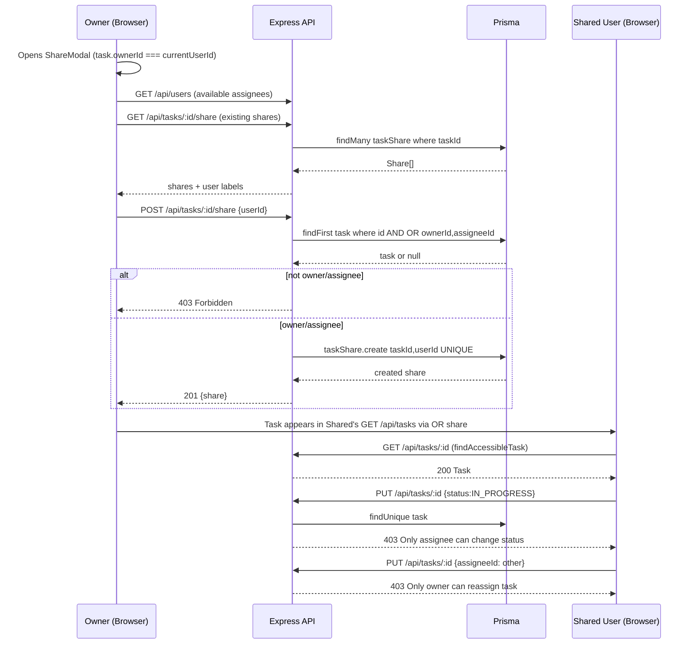

# System Architecture and Flows

The backend implements a layered architecture (Clean Architecture), separating Controllers (Routers), Use Cases (Services), and Repositories.

## REST JSON API
The REST standard is used since the domain (Task CRUD) is flat, making it natural to use HTTP status codes for idempotency (`409 Conflict`) and business rule validations (`403 Forbidden`, `422 Unprocessable Entity`).

## Critical Flow: `markAsDone`
To demonstrate Cloud ecosystem expertise and decoupling of intensive processes, this use case is externalized to an **AWS Lambda**:
1. The client sends a `PATCH /tasks/{id}/done` including the `Idempotency-Key` header.
2. The API intercepts the request and validates idempotency against **Redis**.
3. If valid, the API invokes the Lambda function (deployed on AWS) via the AWS SDK.
4. The Lambda processes the transaction in PostgreSQL and responds to the API, which returns to the client.

## Advanced Technical Considerations (High Concurrency)

### Race Condition Handling
To prevent two requests from marking the same task as `DONE` simultaneously, two layers of protection are implemented:
* **Application Level (Idempotency):** Redis middleware. The `SETNX` (Set if Not Exists) command is used with the `Idempotency-Key` and a TTL. If the key already exists, the duplicate request is rejected, protecting the database.
* **Database Level (Pessimistic Locking):** The SQL transaction uses the `WITH FOR UPDATE` clause on the task row. This ensures ACID atomicity; if Lambda A is updating the row, Lambda B will wait or fail in a controlled manner.

### Connection Pool Exhaustion
When using Cloud Functions that scale horizontally, direct connections to PostgreSQL can exhaust database resources. To mitigate this, **PgBouncer** is placed between the backend/Lambda and PostgreSQL (simulating the role of AWS RDS Proxy).

### Observability and Logging
A middleware is implemented to log all API activity using structured JSON logs. Each log includes: `timestamp`, `actor` (Cognito `user_id`), `method`, `path`, `query_params`, `sanitized_body`, and `status_code`.

## Security: JWT Storage + CSRF

### Design Decision (Implemented)
The Cognito `id_token` is stored in an `httpOnly` cookie (`__Host-id_token`) with `Secure + SameSite=Strict + Path=/`. This decision is paired with **API Gateway as single entrypoint** (`CloudFront -> API Gateway -> Express private VPC`) and a **Double Submit Cookie CSRF** token (`__Host-csrf`).

Previous `localStorage` approach traded XSS security for simplicity; the current design prioritizes XSS protection for production (see Gateway migration spec).

### Tradeoff

| Approach | XSS Protection | CSRF Protection | Persistence | Complexity |
|----------|---------------|-----------------|-------------|------------|
| localStorage (legacy, fallback) | ❌ Vulnerable | ✅ Complete | ✅ Persists | Low |
| **httpOnly Cookie + Double Submit CSRF (current)** | ✅ Complete | ✅ Complete (SameSite + header check) | ✅ Persists | Medium |
| BFF Pattern | ✅ Complete | ✅ Complete | ✅ Persists | High |
| In-Memory | ✅ Complete | ✅ Complete | ❌ Lost on refresh | Low |

### Why localStorage is Vulnerable to XSS
If an attacker injects malicious JavaScript (XSS), they can execute `localStorage.getItem('id_token')` and exfiltrate the token. With the stolen token, the attacker can make authenticated requests as the user. `httpOnly` prevents `document.cookie` / `localStorage` access; the token is only sent automatically by the browser.

### Implemented Production Flow (httpOnly + CSRF)
1. Frontend `LoginPage.tsx` calls `POST /api/auth/login {email,password}` (no direct `cognito-idp` fetch).
2. Backend `auth.controller.ts` uses `CognitoIdentityProviderClient InitiateAuth` to validate credentials, then issues:
   - `Set-Cookie: __Host-id_token=<JWT>; HttpOnly; Secure; SameSite=Strict; Path=/; Max-Age=3600`
   - `Set-Cookie: __Host-csrf=<raw>.<hmac>; Secure; SameSite=Strict; Path=/; Max-Age=3600` (NOT httpOnly, readable by JS)
   - Body `{csrfToken}` for convenience.
3. `axios-client.ts` uses `withCredentials:true` and an interceptor that reads `__Host-csrf` from `document.cookie` and sends `X-CSRF-Token` header on every request.
4. `middlewares/csrf.ts` (`csrfProtection`) enforces Double Submit on all mutating methods (`POST/PUT/PATCH/DELETE`): verifies `cookieToken === headerToken` and HMAC signature (`timingSafeEqual`). `GET/HEAD/OPTIONS` are exempt. `GET /api/auth/csrf` can re-issue/rotate the token.
5. `middlewares/auth.ts` reads `req.cookies['__Host-id_token']` first, fallback to `Authorization: Bearer` for backward compat/migration. Gateway forwards cookies via `VPC Link`; `CORS` is `credentials:true` with explicit `Allow-Origin`.

### Gateway Integration Notes
- CloudFront forwards `__Host-*` cookies and `X-CSRF-Token`/`Idempotency-Key` headers to API Gateway.
- API Gateway `HTTP API` CORS: `allow_origins=[frontend_domain]`, `allow_credentials=true`, `allow_headers=[Content-Type,X-CSRF-Token,Idempotency-Key]`.
- Native Cognito Authorizer (expects `Authorization` header) is not used for cookie flow; JWT verification stays in Express (`auth.ts:verifyToken` via JWKS). Optionally replace with Lambda Authorizer that parses `Cookie` in future.
- `POST /api/auth/logout` clears both cookies (`clearCookie` with same `Secure/SameSite/Path` opts).

## Kanban Board – Drag & Drop Flow

The `DashboardPage` renders tasks as a 4-column Kanban board (`KanbanBoard` + `KanbanColumn`) powered by `@dnd-kit/core` and `@dnd-kit/sortable`. Columns correspond to the strict state machine `PENDING → IN_PROGRESS → DONE → ARCHIVED`.

### Component Hierarchy

```
DashboardPage
 ├─ FilterPanel (TaskFilters → URLSearchParams → useTasks)
 ├─ KanbanBoard (DndContext)
 │   ├─ KanbanColumn status=PENDING  (useDroppable id=status, SortableContext)
 │   │   └─ SortableTaskCard[] (useSortable id=task.id, disabled if !isDraggable)
 │   ├─ KanbanColumn status=IN_PROGRESS
 │   ├─ KanbanColumn status=DONE
 │   └─ KanbanColumn status=ARCHIVED
 └─ TaskForm / ShareModal (dialogs)
```

`KanbanColumn` is a droppable container (`useDroppable({ id: status })`) and a `SortableContext` for its tasks. `SortableTaskCard` wraps `TaskCard` with `useSortable({ id: task.id, disabled: !isDraggable })` where `isDraggable = currentUserId && task.assigneeId === currentUserId`. Drag handle is disabled for shared read-only viewers.

### Drag-End Sequence

```mermaid
flowchart TD
    A[User drags TaskCard] --> B[DndContext closestCenter]
    B --> C{handleDragEnd active.id, over.id}
    C --> D{over.id is TaskStatus?}
    D -- yes --> E[newStatus = over.id]
    D -- no --> F{over is task? newStatus = overTask.status}
    F --> G{containerId fallback}
    E --> H{newStatus === currentStatus? skip}
    F --> H
    G --> H
    H -- same --> I[No-op]
    H -- different --> J{VALID_TRANSITIONS[current].includes(newStatus)?}
    J -- no --> K[Ignore invalid PENDING->DONE]
    J -- yes --> L[onMove taskId, newStatus]
    L --> M[DashboardPage handleMove: permission check]
    M --> N{caller === assigneeId?}
    N -- no --> O[Snackbar Error: Only assignee can move]
    N -- yes --> P[PUT /api/tasks/:id {status:newStatus} via updateWithPermission]
    P --> Q{validateStateTransition}
    Q -- 422 --> R[Snackbar invalid transition]
    Q -- 403 --> S[Snackbar forbidden]
    Q -- 200 --> T[React Query invalidates tasks, re-renders board]
```

Key invariants:
* Invalid transitions are silently ignored on the client (`allowed.includes` guard) and rejected with `422` on the server.
* Permission is enforced twice: client disables drag for non-assignees (UX) and `updateWithPermission` returns `403` (`Only assignee can change status`) if violated.
* `TaskCard` left border is derived from `getDeadlineColor(dueDate)` – overdue tasks keep red border regardless of column.

## Filter Flow

Filters are held in `DashboardPage` as `TaskFilters` and synced to URL `searchParams` for shareable state, then forwarded to `useTasks(filters)` → `fetchTasks(filters)` → `GET /api/tasks?title=&tags=&assigneeId=&...` → `TaskRepository.findByOwner(ownerId, filters)`.

```mermaid
flowchart LR
    U[User interacts FilterPanel] --> S[onChange filters]
    S --> URL[useSearchParams set]
    URL --> Q[useTasks queryKey tasks,filters]
    Q --> API[GET /api/tasks?params]
    API --> REPO[findByOwner OR ownerAssigneeShare + hasSome, mode insensitive, date ranges, urgency, importance, overdue]
    REPO --> DB[(PostgreSQL)]
    DB --> RES[Task[] desc createdAt]
    RES --> Board[KanbanBoard groupByStatus]
    Board --> Card[TaskCard with deadlineBorder]
    FilterPanel --> Chips[Active filter Chips + Clear]
```

* **Title:** `contains + insensitive`.
* **Tags:** `hasSome` (OR).
* **Assignee:** `Autocomplete` from `useUsers()` (distinct assignees/owners the caller can access); single select exact `assigneeId`.
* **Urgency/Importance:** exact `Int` 1–4.
* **Dates:** `gte/lte` on `startDate`/`dueDate` (`Date` parsing). `overdue: dueDate < now()`.
* **Status:** `in` array.
* **URL sync:** `filters` ↔ `URLSearchParams` so refresh preserves view.

## Share Flow



* **Create share** is gated to owner **or** assignee (`OR` in `share.controller`), matching repository scope. UI additionally disables Add for non-owners (`effectiveIsOwner`) but server remains authoritative.
* **Read** for shared users is via `findAccessibleTask` / `findByOwner` `OR shares.some(userId)`.
* **Write** for shared users is denied at `updateWithPermission` level; drag is disabled (`isDraggable=false`).
* **Remove** via `DELETE /api/tasks/:id/share/:userId`; only owner can remove (UI gated, backend reuses `deleteMany` – idempotent).
